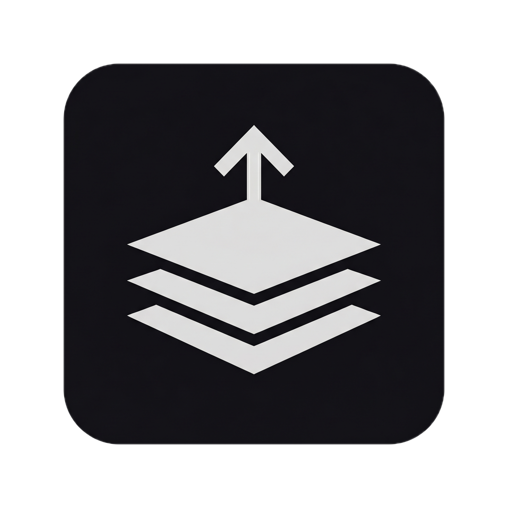

<div align="center">



# Promptly

**A native macOS menu-bar prompt launcher.**
Hit ⌥Space in any text field, fuzzy-find a template, press ↵ — and the fully assembled
prompt drops in right where your cursor was. Focus never leaves the app you're in.


-blue)


</div>

---

You reach for the same prompts everywhere — code reviews, commit messages, standups, cold
emails. Promptly puts them one keystroke away, in *any* app, without ever stealing focus or
leaving your clipboard changed.

```
  ┌─────────────────────────────────────────────┐
  │  ⌥Space                                       │
  │  ┌─────────────────────────────────────────┐ │
  │  │  rev|                                    │ │   ← type a fragment
  │  ├─────────────────────────────────────────┤ │
  │  │  ⌘1  ★ Welcome to Promptly               │ │   ← pinned, ⌘1
  │  │      Code review pass                    │ │   ← fuzzy match
  │  │      PR description                      │ │
  │  └─────────────────────────────────────────┘ │
  └─────────────────────────────────────────────┘
              ↵  →  text lands in the app behind it
```

## Features

- **Summon anywhere** — a global ⌥Space hotkey opens a non-activating palette over whatever
  you're using. The app underneath keeps focus the entire time.
- **Fuzzy search** — type a fragment, get the right template. Results are ranked by how often
  and how recently you use them (frecency).
- **Pins & number keys** — pin your go-to prompts and fire them instantly with ⌘1–⌘9.
- **Tokens** — prompts expand on paste: `{{clipboard}}`, `{{date}}`, `{{cursor}}` (where the
  caret lands), and `{{ask:your question}}` (fills in a value before pasting).
- **Just Markdown files** — every prompt is a `.md` file in `~/Prompts`. Edit them in any
  editor; Promptly live-reloads. Folders become categories.
- **Library window** — a three-pane window to add, edit, pin, and organize prompts.
- **Clipboard-safe** — Promptly snapshots and restores your clipboard around every paste, so
  it's always exactly as you left it.

## Download

> [!NOTE]
> Promptly is **ad-hoc signed** (free, unnotarized), so macOS Gatekeeper needs a one-time
> nudge the first time you open it. The steps below handle it.

1. Download the latest **`Promptly-x.y.z.zip`** from the
   [**Releases page**](https://github.com/MattModeCode/Promptly/releases/latest).
2. Unzip it and drag **Promptly.app** into your **Applications** folder.
3. Open it once with a right-click: **right-click Promptly.app → Open → Open**.
   (Or, in Terminal: `xattr -dr com.apple.quarantine /Applications/Promptly.app`, then double-click.)

> [!IMPORTANT]
> Promptly needs **Accessibility** permission to type into other apps. On first launch it opens
> System Settings for you — enable **Promptly** under **Privacy & Security → Accessibility**.
> Without it, the paste step can't run.

The download is a **Universal** binary and runs natively on both Apple Silicon and Intel Macs.

## Requirements

- macOS 12 (Monterey) or later
- Accessibility permission (prompted on first launch)

## Usage

| Action | How |
|--------|-----|
| Open the palette | **⌥Space** in any text field |
| Filter prompts | start typing a fragment |
| Paste the selection | **↵** |
| Paste a pinned/numbered prompt | **⌘1**–**⌘9** |
| Dismiss | **Esc** |
| Manage prompts | menu-bar icon → **Library…** |
| Open your prompts folder | menu-bar icon → **Open prompts folder…** |
| Rebind the hotkey | menu-bar icon → **Rebind…** |

Promptly runs as a menu-bar agent — no Dock icon, nothing in your way until you call it.

### Writing prompts

A prompt is a Markdown file in `~/Prompts` with optional YAML frontmatter:

```markdown
---
name: PR description           # display name (defaults to the filename)
keywords: [pull request, diff] # extra fuzzy-search terms
pinned: true                   # keep it at the top
hotkey: 1                      # paste instantly with ⌘1–⌘9
description: Summarize a diff   # shown in the Library
---
Summarize this diff as a PR description.

**What changed:** {{cursor}}
**Why:**
**Risk:**
```

The folder a prompt lives in becomes its category. Tokens (`{{clipboard}}`, `{{date}}`,
`{{cursor}}`, `{{ask:label}}`) expand when the prompt is pasted; unknown tokens stay literal so
typos are easy to spot. See [`docs/example-prompts/`](docs/example-prompts/) for ready-to-use
templates and the full format reference.

## Build from source

Promptly builds with `swiftc` directly — no Xcode project required.

```bash
# Dev loop: compile (native arm64) → bundle → install to /Applications → relaunch → tail logs
./run.sh

# Release build: Universal (arm64 + x86_64), ad-hoc signed, zipped to ./dist
./scripts/release.sh 0.1.0
```

> [!NOTE]
> A rebuild can silently revoke Accessibility permission (macOS keys it on signature + bundle
> id + path). If paste stops working after a rebuild, run
> `tccutil reset Accessibility com.promptly.app` and re-grant.

## How it works

The whole product is one tight loop, proven before anything was built around it:

```
⌥Space (Carbon global hotkey)
  → capture the frontmost app BEFORE any UI appears
  → show a non-activating NSPanel + fuzzy filter
  → paste service: AX direct write, with a clipboard-paste fallback
  → verify the text actually landed by reading it back
  → clipboard restored to exactly what it was
```

Promptly writes text through the Accessibility API when it can, and falls back to a
snapshot-restore clipboard paste when it can't — always confirming success by read-back rather
than trusting a return code.

## Documentation

| Doc | What's inside |
|-----|----------------|
| [docs/getting-started.md](docs/getting-started.md) | Tutorial: from install to your first paste |
| [docs/how-to.md](docs/how-to.md) | Task recipes: pins, hotkeys, folders, tokens, fill-ins |
| [docs/reference.md](docs/reference.md) | Every frontmatter field, token, and shortcut |
| [docs/PRD.md](docs/PRD.md) | Product vision, the feeling, success gates, non-goals |
| [docs/FEATURES.md](docs/FEATURES.md) | UX and interaction spec, with mockups |
| [docs/DESIGN.md](docs/DESIGN.md) | Technical design: paste service, hotkey, permissions, modules |
| [docs/TASKS.md](docs/TASKS.md) | Gated build checklist |
| [docs/FEATURE-CATALOG.md](docs/FEATURE-CATALOG.md) | Index of every feature (committed, candidate, non-goal) |
| [docs/example-prompts/](docs/example-prompts/) | A gallery of starter prompts |

Working on the code with an AI assistant? [CLAUDE.md](CLAUDE.md) captures the architecture,
boundaries, and the gotchas most likely to bite.
